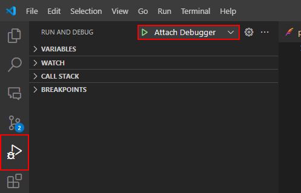

# Greenfoot Maven Starter

This is a simple starter project for using [Greenfoot](https://greenfoot.org/home) outside of its dedicated IDE. Since more experience developers might want to use a more powerful IDE. This project is tailored to run in VSCode but should be usable in every Environment where Maven is supported.

## Installation

To use this project you need to have [Maven](https://maven.apache.org/) installed. You can install it via your package manager or download it from the official website.

If you have any problems with the installation, please refer to the official [Maven installation guide](https://maven.apache.org/install.html).

After you have installed Maven do the following:

1. Clone this repository

   ```bash
   git clone https://github.com/LeoTuet/greenfoot-maven-starter
   ```

2. Open the project in your favorite IDE

3. Install the dependencies

   ```bash
   mvn clean install
   ```

## Usage

:warning: **Always close the application via the close button of the Greenfoot window**: Otherwise the application will keep running in the background. If you are debugging you wont be able start the application because the debugging port will still be in use. To fix this you will need to kill the process manually. This is how you do it on [Windows](https://stackoverflow.com/a/39633428/19043394).

### Running the project

To run the project use the following command:

```bash
mvn clean javafx:run
```

### To Debug the project (VSCode)

To debug the project use the following command:

```bash
mvn clean javafx:run@debug
#Note: The Greenfoot Window will not open until you attach the debugger
```

As soon as the project is Running go to the Debug tab in the `Activity Bar` and execute the `Attach Debugger`. The Greenfoot Window should now open and you can start debugging.



## Update Greenfoot Version

To update the Greenfoot version you need to download the newest version from `greenfoot.jar` and `bluej.jar` from the official release and then run:

```bash
mvn org.apache.maven.plugins:maven-install-plugin:2.3.1:install-file -Dfile="D:\projects\run-for-it\greenfoot.jar" -DgroupId="libs.org.greenfoot" -DartifactId="greenfoot" -Dversion="3.8.2" -Dpackaging="jar" -DlocalRepositoryPath="D:\projects\run-for-it" -DgeneratePom=true

mvn org.apache.maven.plugins:maven-install-plugin:2.3.1:install-file -Dfile="D:\projects\run-for-it\bluej.jar" -DgroupId="libs.org.bluej" -DartifactId="bluej" -Dversion="3.8.2" -Dpackaging="jar" -DlocalRepositoryPath="D:\projects\run-for-it" -DgeneratePom=true
```

Where `-Dfile` is the path to the downloaded jar file and `-Dversion` is the new version. `-DlocalRepositoryPath` is the path to the local repository.

After that you just need to update the versions in the `pom.xml` to the new ones and run

```bash
mvn clean install
```
